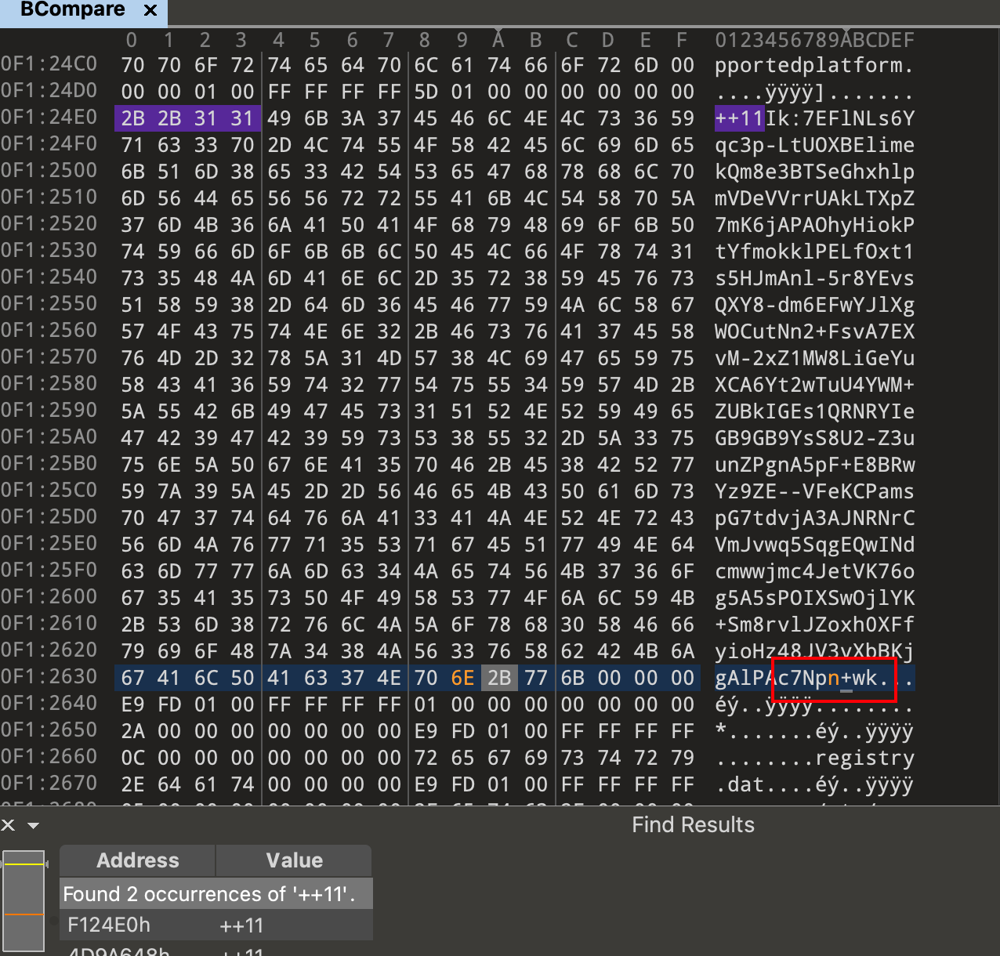
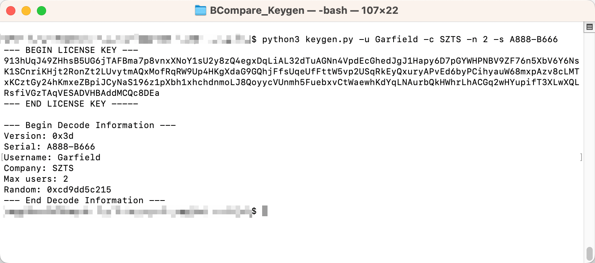
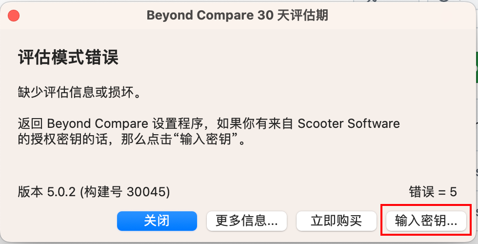
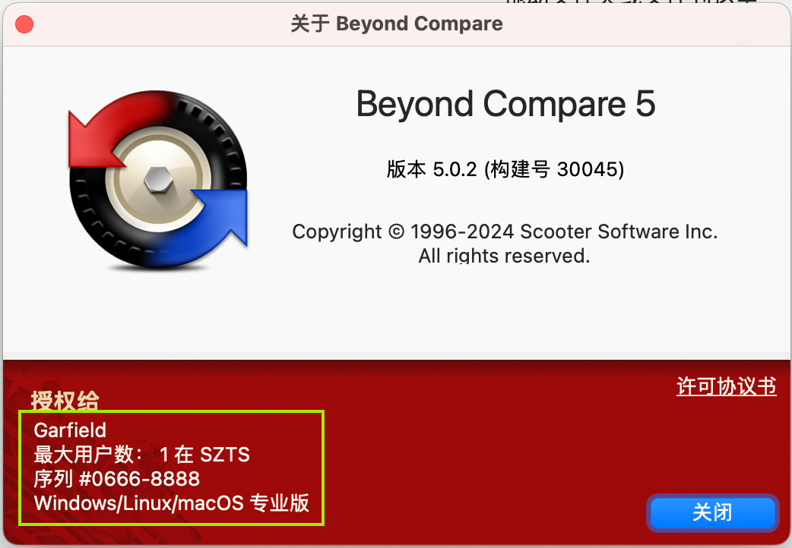

# Beyond Compare 5 Keygen
用于生成 Beyond Compare 5.x 版本注册密钥
## 前置工作
使用 010Editor 等二进制工具，修改 Beyond Compare 可执行文件中内置的 RSA 密钥

修改前：
```
++11Ik:7EFlNLs6Yqc3p-LtUOXBElimekQm8e3BTSeGhxhlpmVDeVVrrUAkLTXpZ7mK6jAPAOhyHiokPtYfmokklPELfOxt1s5HJmAnl-5r8YEvsQXY8-dm6EFwYJlXgWOCutNn2+FsvA7EXvM-2xZ1MW8LiGeYuXCA6Yt2wTuU4YWM+ZUBkIGEs1QRNRYIeGB9GB9YsS8U2-Z3uunZPgnA5pF+E8BRwYz9ZE--VFeKCPamspG7tdvjA3AJNRNrCVmJvwq5SqgEQwINdcmwwjmc4JetVK76og5A5sPOIXSwOjlYK+Sm8rvlJZoxh0XFfyioHz48JV3vXbBKjgAlPAc7Np1+wk
```
修改后（修改字符串末尾的 `p1+wk` 为 `pn+wk` ）：
```
++11Ik:7EFlNLs6Yqc3p-LtUOXBElimekQm8e3BTSeGhxhlpmVDeVVrrUAkLTXpZ7mK6jAPAOhyHiokPtYfmokklPELfOxt1s5HJmAnl-5r8YEvsQXY8-dm6EFwYJlXgWOCutNn2+FsvA7EXvM-2xZ1MW8LiGeYuXCA6Yt2wTuU4YWM+ZUBkIGEs1QRNRYIeGB9GB9YsS8U2-Z3uunZPgnA5pF+E8BRwYz9ZE--VFeKCPamspG7tdvjA3AJNRNrCVmJvwq5SqgEQwINdcmwwjmc4JetVK76og5A5sPOIXSwOjlYK+Sm8rvlJZoxh0XFfyioHz48JV3vXbBKjgAlPAc7Npn+wk
```
 

## 生成注册密钥

```shell
git clone https://github.com/garfield-ts/BCompare_Keygen.git
cd BCompare_Keygen
pip3 install -r requirements.txt
python3 keygen.py
```
得到可用的注册密钥：
```
--- BEGIN LICENSE KEY ---
7uo7UY8gVANuMyCkDtSZRnNBkDXr1o4msYwtu7GFPaZ9B6naWXfsqEBgD5hM8jm3Sw2L4oFHY53VchaHv4j3q4QNiNxPgcv3qz89nKu3VSgQDVpPrAUWKgkjko5Gvck7BBBJmnKbGZJtDTi21WnJ5AMm7upD6QXgbf2BUS7toxB7jzhFLyotDj59KMGkgXMBXeUoa6T7Yt76MZN6UcHqYG5fMLuBp1JfGxpMXE7AMeUXXLwvAxsJGMkC5oS93WoVLopUoBW4SYNpS7YzzirkqZdRt58TbQpqcvwFeD32X2ZamVAv9SjeQUQhyEwktExFwTc541HrJeDV2xqfr4EgbUprSWEu8p
--- END LICENSE KEY -----
```
默认生成的注册密钥使用以下信息：
```
Version: 0x3d
Serial: Abcd-Efgh
Username: Test
Company: Home
Max users: 1
```
可以通过传入相关参数，自定义注册密钥的信息

 

## 使用密钥进行注册
打开 Beyond Compare 5，此时会弹出 `评估模式错误` 的提示，点击 `输入密钥` 按钮进入注册页面：

 

将脚本生成的注册密钥粘贴到输入框中，点击 `确定` 即可激活。

 

 

## TODO

- 集成二进制文件 patch 功能
- ……
